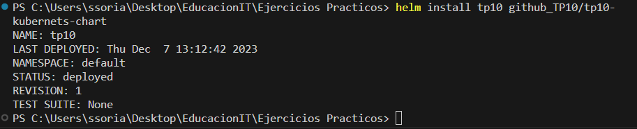
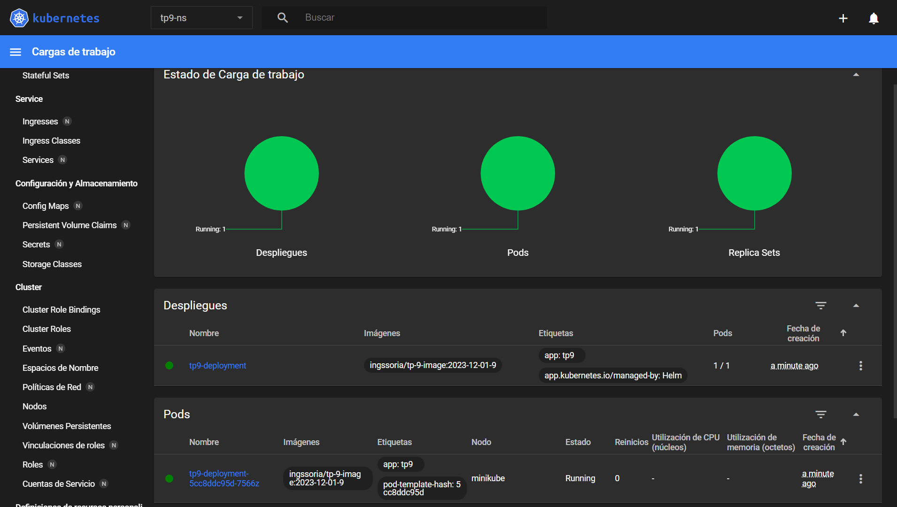
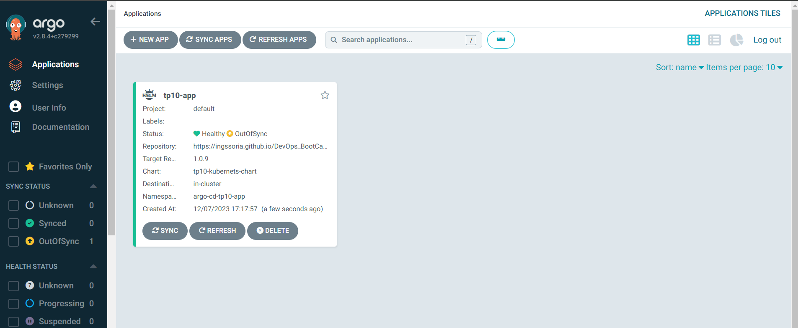
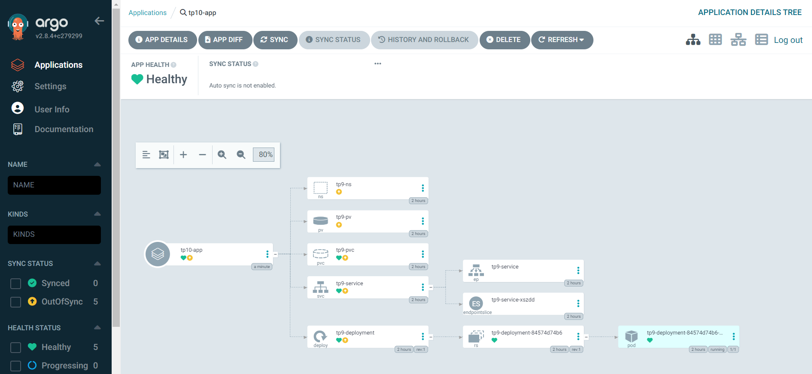

## Descripción del desafío

En este desafío nos encontraremos una mezcla de otros desafíos (CICD y Kubernetes), en este caso utilizaremos herramientas de Gitops para automatizar cambios en nuestro deployments y en cualquier otro archivo yaml que configuremos, de esta forma será solo cuestión de hacer los cambios en el código .yaml y dejar que la herramienta que hayamos elegido se encargue de aplicar nuestros cambios (ya sea de forma manual o automática).

Entregable:

* Manifiesto de kubernetes que se aplicará en el cluster, puede ser el deploy de un pod con una imagen.

* Documento con instrucciones de cómo se realizó el desafío (de ser posible adjuntar capturas de pantalla). 


#### Tareas desarrolladas para la resolución del Desafío
1 - Configuración en GitHub de las Pages
* Generar un Token Classic en la configuración de la cuenta.
* Crear el secret TOKEN para las actions del repositorio asignándole como valor el token antes generado.
* Crear la rama gh-pages:
```bash
git branch gh-pages 
git push --set-upstream origin gh-pages
```
* Crear y configurar las Actions.
* Generar page en la configuración del repositorio.
* Ejecutar las Actions que generan el release y el index.yaml en la branch gh-pages.

2 - Instalación y configuración de Helm
* Con chocolatey (abrir powershell como admin) ejecutar:
```bach
choco install kubernetes-helm -y --params "/Global"
``` 
* Configurar el repositorio del proyecto:
```bash
    helm repo add github_TP10 https://ingssoria.github.io/DevOps_BootCamp_EIT/
    helm repo list
```

3 - Iniciar Minikube
* Ejecutar DockerDesktop.
* Iniciar el kluster soportado en Docker (abrir powershell como admin) ejecutar:
```bash
    minikube start --vm-driver=docker
    minikube dashboard
```

4 - Instalación del Chart
* Actualizar el repositorio:
```bash
    helm repo update <nombre_repositorio>
    helm repo update github_TP10
```
* Instalar o actualizar el Chart:  
```bash
    helm install <nombre_del_release> <nombre_repositorio>/<nombre_del_chart>
	helm install tp10 github_TP10/tp10-kubernets-chart
	helm upgrade tp10 github_TP10/tp10-kubernets-chart -f values-prod.yaml
```



* Acceder al Chart configurando el port-forward:
```bash
kubectl port-forward service/tp9-service -n tp9-ns 85:80
```
[tp10-kubernets-chart](http://localhost:85)

5 - Instalación de ArgoCD en Minikube
* Con chocolatey (abrir powershell como admin) ejecutar:
```bash
    choco install kubernetes-helm -y --params "/Global"
``` 
* Instalar el chart del Proyecto ArgoCD:
```bash
    kubectl create ns argo-cd
    helm repo add argo https://argoproj.github.io/argo-helm
    helm install argocd argo/argo-cd -n argo-cd
```
6 - Obtención de la password del usuario `admin` y acceso Dashboard ArgoCD (Windows SO).
* Instalar el programa base64, para eso ejecutar:	
```bash
	choco install base64 -y --params "/Global"
```
* Obtener la password
```bash
    kubectl -n argo-cd get secret argocd-initial-admin-secret -o jsonpath="{.data.password}" | base64 -d
```
* Acceder al Dashboard de ArgoCD configurando el port-forward
```bash
kubectl port-forward service/argocd-server -n argo-cd 8080:443
```
[ArgoCD Dashboard](http://localhost:8080)

8 - Desarrollar manifiesto de la aplicación a desplegar con ArgoCD:
[Manifiesto para deploy con ArgoCD](/TP_10/argocd/application.yaml).

7 - Crear la aplicación en ArgoCD.
```bash
kubectl apply -f application.yaml
```




