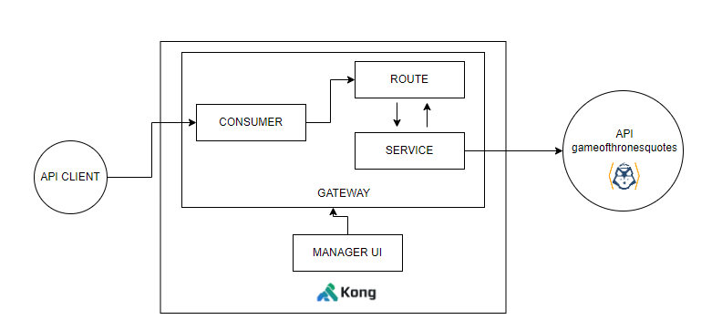

## Descripción del desafío
Haciendo uso de lo visto en clase deberás realizar la publicación de la siguiente API Pública.
https://gameofthronesquotes.xyz/
1. Desplegar una instalación de KONG en Minikube.
2. Publicar una API haciendo la definición del servicio y router mediante el Admin API de Kong.
3. Mediante algún cliente REST/CURL validar el funcionamiento del API Gateway llamando al método https://api.gameofthronesquotes.xyz/v1/author/tyrion/2. Acordate de actualizar la URL para que implemente tu API Gateway.
4. Agregar algún mecanismo de autenticación del lado del API Gateway.
#### Entregable:
Como entregable de este desafío esperamos una documentación cuente con la siguiente
información:
* Explique cada uno de los pasos que se realizaron para instalar el producto KONG en minikube.
* Muestre y liste los comandos CURL utilizados para publicar la API propuesta.
* Informe los comandos CURL que se ejecutaron para realizar las pruebas, recuerda que tiene que existir una llamada a la API con autenticación.
* Diagrama de alto nivel de cómo están desplegados los componentes.


#### Integrantes
* Gustavo Marcos
* Sindy Soria Francis


#### Tareas desarrolladas para la resolución del Desafío
1 - Instalación de Kong Gateway en Minikube

* Configurar el espacio de nombre para Kong:
```bash
    kubectl create ns kong
```

* Crear variables de credenciales y configuración de Kong:
```bash
kubectl create secret generic kong-config-secret -n kong
   --from-literal=portal_session_conf='{"storage":"kong","secret":"super_secret_salt_string","cookie_name":"portal_session","cookie_same_site":"Lax","cookie_secure":false}'
   --from-literal=admin_gui_session_conf='{"storage":"kong","secret":"super_secret_salt_string","cookie_name":"admin_session","cookie_same_site":"Lax","cookie_secure":false}'
   --from-literal=pg_host="enterprise-postgresql.kong.svc.cluster.local"
   --from-literal=kong_admin_password=kong
   --from-literal=password=kong
```

* Crear un secret para la licencia de Kong Gateway Enterprise:
```bash
kubectl create secret generic kong-enterprise-license --from-literal=license="'{}'" -n kong --dry-run=client -o yaml | kubectl apply -f -
```

* Crear el repositorio para Cert Manager
```bash
helm repo add jetstack https://charts.jetstack.io
helm repo update
```

* Instalar Cert Manager
```bash
helm upgrade --install cert-manager jetstack/cert-manager \
   --set installCRDs=true --namespace cert-manager --create-namespace
```

* Crear un Issuer de certificados SelfSigned
```bash
kubectl apply -n kong -f cert_manager_issuer.yaml
```

* Crear el repositorio para Kong
```bash
    helm repo add kong https://charts.konghq.com
    helm repo update
```

* Instalar Kong Chart:  
```bash
    helm upgrade --install quickstart kong/kong -n kong -f values-custom.yaml
```

2 - Configurar el Admin API de Kong y validar el funcionamiento del API Gateway
* Desde https://cloud.konghq.com/ agregar un nuevo Data Plane para habilitar con vinculo con el cluster de Minikube.
* Generar secret para los certificados del Kong Konnect (guardar como archivos locales: tls.crt y tls.key) y ejecutar comando:
```bash
kubectl create secret tls kong-cluster-cert -n kong --cert=/{PATH_TO_FILE}/tls.crt --key=/{PATH_TO_FILE}/tls.key
```
* Instalar Kong Gateway
```bash
helm install kong-gateway kong/kong -n kong --values ./values-konggateway.yaml
```
* Crear un Gateway Service
* Crear los Routes
* Crear los Consumer
* Comandos CURL habilitados
```bash
https://gameofthronesquotes/tp12service/v1?key="34nwgh892yfaxmlemswqokxsazx412"
```

3 - Diagrama de Despliegue de Copmponentes:

